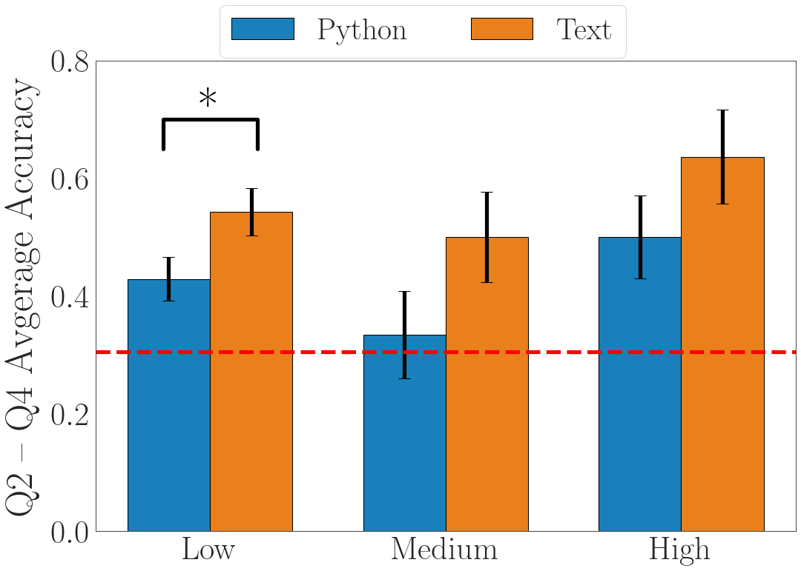
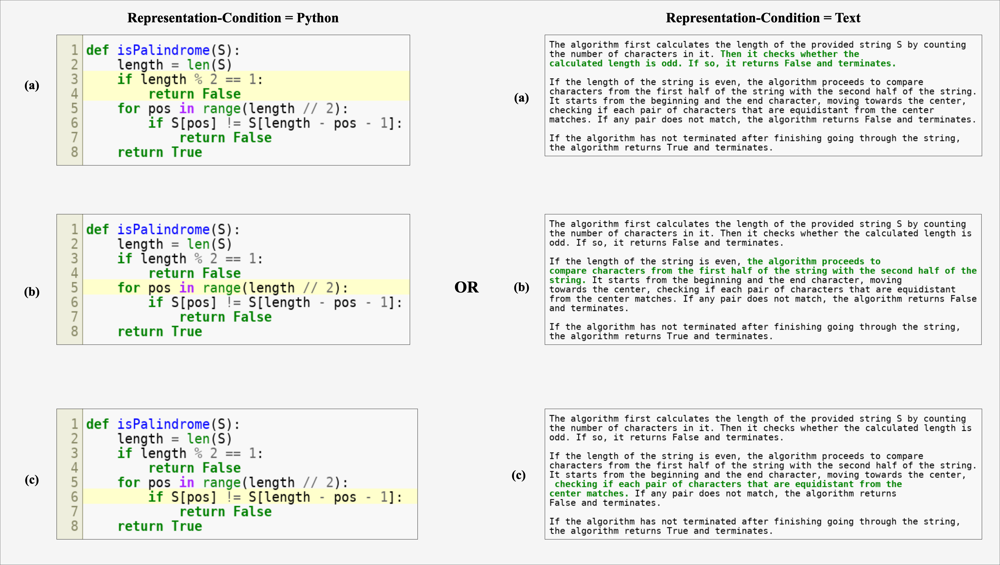
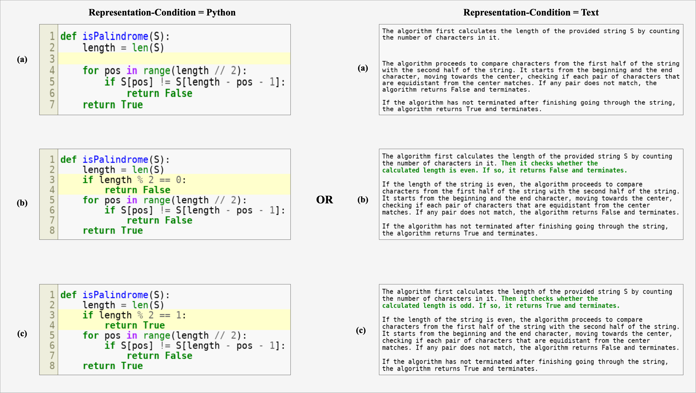

## Data and Analysis scripts for "Hints Help Finding and Fixing Bugs Differently in Python and Text-based Program Representations"

### Requirements

Python version 3.11.7

You can install the required packages using: 

`pip install -r requirements.txt`

### Contents
- `analysis_data.csv`: The raw dataset
- `avg_analysis_data.csv`: The dataset with one response per participant, used for accuracy visualizations.
- `filtered_avg_analysis_data.csv`: The dataset containing responses that get Q2,Q3,Q4 right, used for response time analysis.
- `plot_rq1.py`: Python script to generate Figure-3 in the paper.
- `plot_rq2.py`: Python script to generate Figure-4 in the paper.
- `plot_rq3.py`: Python script to generate Figure-5 in the paper.
- `plot_time_rqs.py`: Python script to generate Figure 6 in the paper.
- `plot_h1_v_h2.py`: Python script to generate the figure present in [Additional Results](#additional-results)
- `figures/`: directory containng all the generated figures.

### Dataset Description
This dataset contains information about participants' performance on programming tasks, including their responses, timing, and scores. Below is a detailed description of each column in the dataset:

- **ResponseId**: Unique identifier for each participant's response.
- **Duration (in seconds)**: Total time taken to complete both tasks.
- **Q_prog_rate**: Self-reported programming skill rating (scale: 1-10).
- **Q_prog_exp**: Self-reported programming experience (scale: 0-5).

- **hint_type**: Category of hint provided to the participant.
- **stimulus_presentation**: Format of the presented stimuli (Python code or Text description).
- **part_lbl**: Participant label, categorized as either "Confused" or "Clear" based on their score for Question 1.
- **task**: Description of the algorithmic task or problem type.
- **prog_num**: Identifier for the specific algorithm program.

- **desc_time**: Time spent viewing the algorithm task description.
- **algo_time**: Time spent viewing the program algorithm (if applicable).
- **hint_time**: Time spent viewing the hint (if provided).
- **quantques1_time**: Time taken to answer Question 1.
- **quant2_time**: Time taken to answer Question 2.
- **quant3_time**: Time taken to answer Question 3.
- **quant4_time**: Time taken to answer Question 4.
- **quant_ques_af_exp_time**: Cumulative time taken to answer Questions 2, 3, and 4.
- **quant_ques_af_exp_time_avg**: Average time taken to answer Questions 2, 3, and 4.

- **score_quant1**: Score for Question 1.
- **score_quant2**: Score for Question 2.
- **score_quant3**: Score for Question 3.
- **score_quant4**: Score for Question 4.
- **quant234_avg_score**: Average score for Questions 2, 3, and 4.

### Additional Results



We conducted a preliminary investigation by analyzing participants divided into three groups based on self-reported programming proficiency: low, medium, and high experience. Our findings reveal that participants across all experience levels performed better with text-based representations than with Python. This effect was significant for those with low programming experience (p-value: 0.021, effect-size: 0.452, difference of means: 0.08).

### Stimuli Details

We present all the problem examples for each algorithmic task in the directory `stimuli/`. Specifically, for all examples, we provide: the problem description, quantitative question-answer pairs (Q&A1, Q&A2, Q&A3, Q&A4), the Python program representation, the text-based program representation, and the three distinct hint conditions. The directory is organized into subdirectories: `python_data`, `text_data`, `explanation_data`, and `quantitative_data`. Each subdirectory contains folders for specific algorithmic tasks, housing the corresponding stimuli (e.g., Python data, text data, explanation data) for all problems related to those tasks.

Below, we present questions along with the answer choices for the "Palindrome String" algorithmic task illustrated in Figure 1 of the main paper.

Q1. Select the expected output of a correct algorithm for the following test case: racecar
```gray
a. True
b. False
c. racecar
d. None of the above
```

Q2. Select the output of the buggy algorithm for the following test case: racecar
```gray
a. True
b. False
c. racecar
d. None of the above
```

Q3. Which of the following algorithmic snippets highlight the location where changes are sufficient to fully correct the algorithm?


<br><br>

Q4. Which of the following algorithmic snippets’ highlighted edits fix the bug?

